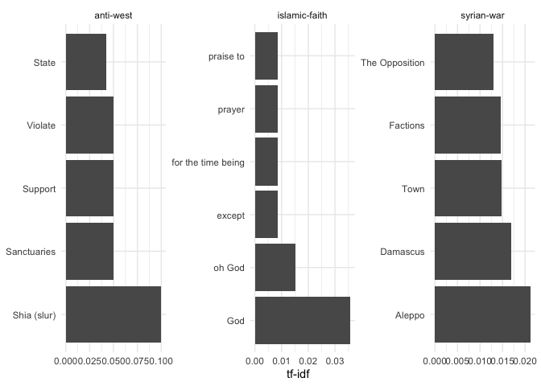
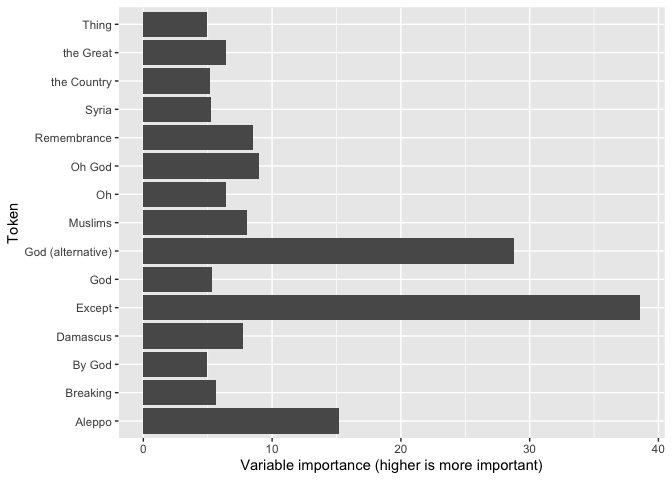

Code Sample 1
================
Seth Harrison
4/30/2020

The following project is adapted from a homework assignment on
supervised classification.

For this project, I decided to perform supervised classification on a
dataset containing the Arabic text of tweets related to the Syrian civil
war, along with labels classifying those tweets into one of 7 general
content areas. The content areas included:

  - islamic-faith
  - syrian-war
  - is-sympathy
  - is-life
  - anti-west
  - syrian-war
  - Islamophobia

## Exploratory Analysis

Upon importing the data, I discovered that \~600 of the 1350 total
observations were classified into a content area, which allowed me to
train the model. For the exploratory analysis, I used term frequency
inverse document frequency to generate the plot below:

<!-- -->

We see like-terms in the three content areas depicted. Particularly
within the islamic-faith content area, we observe religious terms. These
tokens ended up being particularly useful in the statistical learning
model.

## Supervised Classification

    ## Ranger result
    ## 
    ## Call:
    ##  ranger::ranger(dependent.variable.name = ".outcome", data = x,      mtry = min(param$mtry, ncol(x)), min.node.size = param$min.node.size,      splitrule = as.character(param$splitrule), write.forest = TRUE,      probability = classProbs, ...) 
    ## 
    ## Type:                             Classification 
    ## Number of trees:                  200 
    ## Sample size:                      614 
    ## Number of independent variables:  56 
    ## Mtry:                             29 
    ## Target node size:                 1 
    ## Variable importance mode:         impurity 
    ## Splitrule:                        extratrees 
    ## Number of random splits:          1 
    ## OOB prediction error:             24.76 %

Removing sparse terms allows us to increase the number of “trees” in the
model, and decrease the prediction error.

<!-- -->
